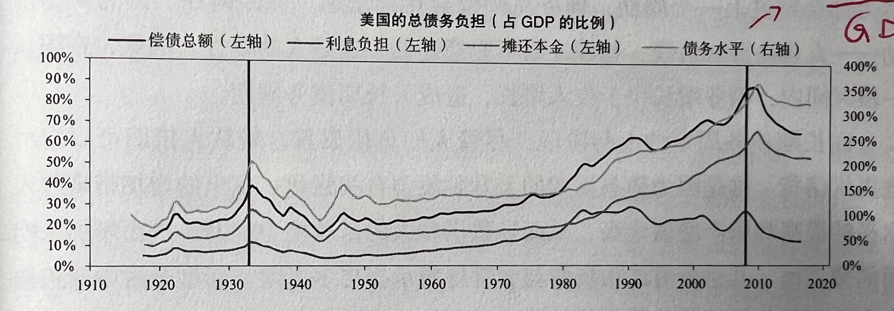

# 《债务危机·我的应对原则》

> Ray Dalio	<美>

## 01 前言

​		资本市场和实体经济密不可分，我是一名汽车工程师，与我而言，毫无疑问是实体经济的亲历者，但是在未来，我也憧憬着进入资本市场追名逐利。我是一名俗人，需要挣钱养家，难以控制对名利的欲望，幸而给自己建立了一个在任何领域之上的价值观或者说追求：我希望通过其他人的眼睛，以更多更高的维度来审视这个本质上相同的世界。

​		宋朝苏轼有《题西林壁》：

​																						横看成岭侧成峰，远近高低各不同。
​																						不识庐山真面目，只缘身在此山中。

​		同样的山峦，因为不同的角度而呈现不同的状态，但是归根结底，皆反映出单一视角的局限性。这种“局限性”对于“旅行者”是友好的，如果思想趋于一致，人世间单调乏味，又有什么滋味可言。对我而言，我尤为欣赏这种差异化，尤其是更为高级的差异化。怎么理解，在同一条大街上居住的乞丐和学者对他们所生活的环境当然有不同的认知，乞丐可能在想哪一个位置可以乞得更多的钱财，对学者来说可能是回家归途中的一次放空或者又一次思索。这里并无歧视之意，毕竟世间百态皆为自然选择，需要尊重任何合理的存在。但我毫无疑问更愿意和那些“学者”攀谈一二，因为其拥有更高级的差异化。从另一个角度，以博士而言，博士的研究在于突破我们认知的边界，在一个方向深究。两个不同方向的博士彼此就有更加巨大的差异性，这对我有致命的吸引力。

​		说回我的专业和工作，原因也就不言而明了：汽车作为独一无二的商品具备着巨大的能量，背后藏着一条可以养活数千万人的供应链，在这个领域工作具备和不同领域“博士”交谈的可能，可以满足我毕生的追求。同理，金融也一样。

​		读这本书的目的就是想搭一座桥，试着在桥上看看分居两侧的实体经济和资本市场，我也期待未来可以构筑更多更大的桥梁。

---

​		废话说完，回到这本书中，作者Ray Dalio在前言中想要说明这本书的来由和研究背后的逻辑。作为一名全球宏观投资者，他偏向通过资本市场押注经济变化，通过观察资本的运动得出想要的经济规律。他经历过多轮金融危机，对经济周期、债务周期产生了强烈的好奇心，试图找到周期背后的因果关系。这种原因也是蛮朴素的，如果一件事发生了四五次，我们便想通过归纳来寻找之间的联系进而推论出未来的走势，所以与其说来自历史归因带来的好奇和动力，不如说来自想要掌控未来带来的野心。

​		Dalio就是一名理论深厚并具备丰富实操经验的医生，他在众多的病例中抽丝剥茧，形成规律模型，并帮助桥水度过了2008的金融危机，在这段艰难的时期，桥水仍旧实现了客观的盈利。

​		他在这本书中分享的内容有以下几点：

​				1. 我的典型债务大周期模型

​				2. 针对三个标志性案例的详尽研究（2007—2011年的美国；1928—1937年的美国；1918—1924年的德国）

​				3. 针对48个案例的研究纲要，包括过去100年间发生的主要债务危机

​		Dalio在文中写到：

> ​		“对我来说，每天观察经济和市场（或者其他任何事件的演变），就像面对一场不断变化的暴风雪，有数以万计的线索和信息扑面而来，而我必须综合处理这些线索和信息，并妥善应对。”

​		而我们又何尝不遇到暴风雪呢······

> ​		“要说明的是，我理解不同的人有不同的观点，我的观点只是其中之一。我们各自提出观点，并就问题展开辩论，以加深我们对问题的理解。这就是我分享债务危机研究成果的目的。

​		最后，再说点我追求的另一种精神或者说方法论，永远保持探究事物原理本质的热情。以电路图为例，很多人建议我从目的和需求出发，不要过分在意每一个电容每一个电阻的意义，甚至过分探究三极管的化学原理，这样效率低浪费时间。诚然，一个人的精力是有限的，像我这种本就不聪明的人更是如此，但是我不会妥协的，这是我的根基，我需要保持着这种惯性，这种挖掘本质的耐心，如果这让我”万劫不复“，那我也”死而无憾“。

​		众争勿往，见路不走，实事求是。

## 02 我如何看待信贷和债务

​																																																

​		Dalio在文中强调：要明确”信贷“和”债务“！

> ​		”信贷是指赋予他人购买力，他人承诺今后偿还该购买力，即偿还债务。“

​		我也试图用自己的方式去理解。信贷是两个字”信“和”贷“组成的，“信”代表信誉，”贷“代表贷款。“信”是条件，“贷”是动作。我们都知道贷款是两方以上的商业活动，我们不可能自己贷给自己。而促成贷款实施的前提是信誉，借款人没有可以证明信誉的前提，出借人肯定不会发款的。总而言之，信贷是一种形式或者说方式，是购买力的转移，体现用信用换取”金钱“这一过程，这里的金钱打引号是因为我不能肯定只能换取money，应该也可以换别的。P.S.感觉信贷的范围应该>贷款。

​		再来谈谈债务，我理解“债”就是你需要偿还的东西；“务”是义务，你不能不还。借款人借到”款“以后，承诺今后要偿还这种本不属于你的购买力，包括本金啊，利息啊什么的，这些就是债务。

​		Dalio认为信贷本身是件好事。一个人的精力是有限的，对于能赋予他人购买力的个人也好企业也罢，这些角色肯定是我们普遍认可的成功人士，俗称“有钱人”，但是越是成功的人越繁忙，比如我在汽车领域挣了钱，我的精力肯定都投入这个领域了，虽然财富越来越高，但是获利方式单一。与此同时在另一个行业的某个“路人甲”，能力很强，苦于没有资本支持，无法在这个领域大展宏图，对“路人甲”和这个领域来说都是一种损失。所以如果可以把”有钱人“的钱借给“路人甲”，那就实现了 triple win。换言之，信贷创造了购买力，而社会需要购买力去推动。

---

​		从人性来说，包括我本人，普遍不想借钱给他人，却想他人借给我。这是一种不可控带来的危险感，“钱在手里我才安心”。尤其是父辈更是如此，经历过物质缺乏的年代的人，深知攥在手里的才是自己的。这里我也想强调一点我目前对金融的看法：**金融是物理和人性交织而成的产物，物理反映不以人意志为转移的客观规律，人性则反映价值。一个苹果的质量是确定的，但是价值却可以因为人性而改变。与我们而言，离物理层面越近、越能剥离人性，越能掌握财富密码，但是同时，我们可能更不像“人”。**

---

​		那么真实的信贷到底是好是坏呢，Dalio强调要从结果上看，并且信贷/债务增长过慢甚至更糟，因为社会因此缺少了发展的机会。

> ​		“判断信贷/债务快速增长是好事还是坏事，取决于信贷产生的结果和债务偿还情况，取决于能否把借款用于生产性目的，从而创造书足够多的收入来还本付息。”

​		还本付息还是过于狭义了，所以Dalio还着重提到了一些间接好处，比如投资给教育可以降低犯罪率；替换低效的基础设施可以提高劳动生产率。

​		总之还是那句话，信贷本身是好的，如果可以的话，我觉得应该尽可能鼓励信贷，但是，事物的两面性的告诉我们并不那么简单。我已经提到过，我认为人愿意把钱攥在手里的原因是因为钱一旦脱离掌控便越发的不可控，“欠账还钱，天经地义”的事情尚且很难都做到，更别说还要这个“账”本身还得生更多的钱。想要把借款用于生产目的，说到底是借给能够把借钱用于生产目的人/组织手里。这个人/组织做到了“钱生钱”，则社会向前大踏步的前进；反之“钱吞钱”，则引发危机。

​		一个国家是无法左右借钱给谁这个问题的，他可以进行宏观的资产调配，但不能事无巨细亲历亲为。我们当然想把钱都给“专家”调配，但是**你怎么知道那个目前不是“专家”的人将来就不能成为“专家”呢？**

---

​		这里我想写一些我对市场经济的理解，虽然我并没有学习过，甚至哪怕看一眼市场经济的定义······

​		市场经济就是经济生态下的自然界，讲究优胜劣汰适者生存，不同于自然法则，人不会丢失生命，没有那么残酷，且有一些像反垄断法的条例来帮助你生存，但是企业的生命在这个参考系下不必生命强大多少，甚至更加脆弱。但是，这种环境下筛选出来的企业才具备推动“自然”进化的能力，才可以推动社会进步。

---

​		国家对于信贷的宏观把控可以通过收紧/放宽贷款标准，或是增加/减少贷款利息。其实，这也是一个筛选的过程。

### 2.1 与拒绝借债相比，不良债务的代价几何？

> ​		“假如你作为一个政府决策者，准备建设一条造假10亿美金的地铁，项目的资金来源是债务融资，期望用地铁未来的收入偿还债务。但项目建成后，经济形势开始变得糟糕，以至于实际收入只有预期的一半，债务只能减记50%，那么，这是否意味着你当初不应该建造这条地铁？”
>
> ​		“换句话说，问题是地铁线的成本比最初的预算多了5亿，亦或者，如果地铁的使用寿命为25年的话，地铁每年成本都比预算多出2%，从这个角度看，你或许会得出这样的评估结论：建造价10亿美元的地铁比不建地铁好得多。”

	债务减记：债券减记，最理想的状态是债权人大度，最终接受投资失败，发债人勾销债务（现实不可能）；常规的债券减记，代表双方协商之后，违约的债，短债变长债，旧债变新债！
	一般会把债分为两部分处理，当前能还的债，先还了，（利率会比较低，导致违约的实际损失还是债权人承担了）还不了的，作为新债，重新约定利率，之后在新的约定期再进行债务偿还，相当于兑现日期、兑现金额、兑现利率发生了变化。同时债权人手中剩余的旧债部分替换为协定的新债！

​		说实话，这两个例子我真的没怎么明白，或许我目前并不具备决策者的能力......Dalio的意思是如果能将举债的风险分摊到多年，那就不会有无法承受的坏账......

​		还放了个数学例子：

​		当**>40%**的贷款无法偿还就会出现坏账损失，这40%的未偿贷款里，不良贷款约占20%。
$$
总债务=1 \\
未偿债务=1\times40\%=40\% \\
不良贷款=未偿贷款\times20\%=8\% \\
\therefore 坏账损失=8\% 
$$
​		一个国家的总债务大约为GDP的200%，坏账损失为GDP的16%，如果这个损失以15年为限分摊到全国，也就是损失“社会化”，每年损失为GDP的1%左右，这个规模可以接受......

​		这感觉就像苹果24期分期每期只要300元......一些人会觉得不要钱买手机一样。

### 2.2 债务危机是不可避免的吗？

​		很难，就像只有少数人可以考100分那样难。政府想避免危机，可是政府终究是人组成的啊，大家都是趋利的。还是拿老百姓攥钱不放贷举例，大家因为害怕风险而不借钱，但是一旦你借钱给了一个能加倍给你回报的人，我们称其为“大师”吧。比如借给“大师”100元，他几天就还给你200元，那下一次他向你借钱就会更容易且你借出去的数额也会更大。风险一直都在，但是在利益的驱使下总是容易让人忽略，因为收获利益的同时，你还会增加“大师”的“信用”，信贷信贷，信用多了，贷就多了。如果某一天，你发现“大师”没有按时给钱，你跑过去问他要，他说正在回笼资金准备干票大的，现在没有办法还你钱，这个时候你会怎么办？

​		“大师”给你两个选择：

​				1. 再等等，等我那边挣钱挣大发了，我把你需要的钱给你，反正现在给不了。负向

​				2. 你再给我点钱，我迅速回笼资金，给你更多的回报。正向

​		这一正一反两种推力作用下，你会怎么办呢？我想大多数人都会选择第二种，就像脱口秀说的那样：**“我们是既想要高回报同时又不接受本金出现任何损失的散户。所以不要给我扯什么止损，ALL IN！我就喜欢梭哈！”**

​		对于政府也是如此，**放宽信贷永远比收紧信贷更容易**。

### 2.3债务危机为何有周期性？

> ​	Dalio说，周期无非是一系列合乎逻辑、以固定模式反复发生的事件。

​		我很喜欢他的举例：当你一旦借钱，就会创造一个周期。买一件你目前买不起的东西，你的消费必然会超出你的收入。**借款时，你不仅是在向贷款人借钱，你实际上是在向未来的自己借钱。**在未来的某个时候，你必须要降低消费水平，以偿还债务。

​		另一个大富翁的例子：**游戏初期是“房地产为王”，后期则是“现金为王”**。深深的感受到了王健林的高瞻远瞩，深谋远虑。

​		接着Dalio提出了一个贯穿始终无比重要的点——自我强化。正的越正，负的越负。自我强化的上升—顶点—自我强化的下降。

上升过程：
$$
贷款\uparrow \ \Rightarrow \ 支出和投资 \uparrow \ \Rightarrow \ 收入和资产价格 \uparrow \ \Rightarrow \ 借贷\uparrow
$$
​		这是一个自我强化的闭环运动。那这个上升的顶点在哪里呢？

> ​	“当偿债成本（即还本付息的成本）超过维持支出的借款时，债务上升周期就会逆转。

​		对于新兴经济体（我感觉中国也是），依靠房地产、固定资产投资和基础建设拉动经济强劲增长。但是这类融资对象有一个特点，那就是在建造初期对经济有很大的拉力。在知乎中看到一条，地产项目的本质就是通过信贷快速的制造货币出来，也就是印钞机，变相的增加社会上钱的流通性。这个地方我的理解是，刺激经济就是增加money的流通性，想象一个场景，青藏高原上有一个小小的沱沱河，以它为源头的河水由于高海拔带来的重力势能，不断向大海流去，期间不断汇入各种河流与雨水，汇集成川流不息的长江黄河，发源出华夏文明，养育一方水土。如果！我把源头掐死，让沱沱河变成沱沱湖，就像“死”钱越聚越多，会发生什么？水都聚集在上游，而下游干涸的河流必将带来一片生灵涂炭。所以说，钱得流动起来，不能让水都呆在海里或者沱沱湖里。

​		政府为了增加钱的流通性，选择了房地产，或者说这是为数不多的选择，因为房地产可以聚集大量资金，有着金融属性，给这条河流的流动性提供保障，不能河水还没流到目的地就断流了。或许有人问了，那我选择制造业不行吗，也可以聚集大量资金啊，但是制造业不可控，说白了，建楼的难度才有多少，有地有钱有人就是分分钟的事情。于是，政府就给上游的沱沱湖XX湖说，你们开闸放水吧，我借钱给你们挖河道，给你开绿灯，什么河道影响环境之类的问题都不要紧，你赶紧挖，将来我把河道的运营权也分给你一些。好了，这些原本有钱现在更有钱的大“湖”们纷纷开始挖河道，散户一看，这是干啥呀？声势浩大呀，有利可图呀，可是苦于没钱投入，向政府借钱，也投入力量开挖，期望河水往自己这里多流一点，即所谓解放大户，带动散户。

​		但是，看似美好的房地产投资却有着一个令人难过的特点，那就是房子一旦建成，所有的花费立刻减少为零，不会有新的投资进入这个房子，也不需要用资金再买劳动力和建筑材料，也就是房子一旦成型，河水立刻断流，不得不再寻找新的房子。（如果买一台游戏机用来娱乐，则不会带来收入；如果你买一台拖拉机用来生产，赚更多的钱偿还债务，就能提高生活水平。）所以政府这也不行呀，不能房子建成就不流动了，没关系，政府可以提升房价，增加二手交易引入新的投资。可是房子终归是买来住的，要是大家都疯狂炒房，让买不起房子的人干脆不买选择躺平，任你怎么刺激我，我自巍然不动。炒房客的钱是信贷借来的，你不买我可怎么还贷，还不起就只能贱卖了，你一卖让原本就饱和的市场更饱和了，就变成了囚徒困境，大家分分抛售房产力求个人最优解，毕竟，“自己吃好全家不饿”，人都是利己的，最后发生什么可想而知，一地泡沫。

​		政府和银行是个聪明人，通过数据可以觉察到泡沫的出现，比如你借贷并不是为了投资，你只是为了还以前的贷款（周转性融资，及更惨烈的旁氏融资）。政府银行不愿意，就收紧信贷，提高贷款便准，或者加息。

下降过程：
$$
贷款\downarrow \ \Rightarrow \ 支出和投资 \downarrow \ \Rightarrow \ 收入和资产价格 \downarrow \ \Rightarrow \ 借贷\downarrow
$$
​		对于债务周期循环，其中损失很容易想象。**对于发债人，借债人还不上就会导致定期付款金额下降或债务价值减记；而对于借债人，除了身背债务带来的压力外，他所处的实体行业也会因为投资的腰斩而丧失活力，即便未来也难以维持危机前的支出水平。**

### 2.4 能否妥善管理大部分债务危机，避免出现严重问题？

​		Dalio说道，债务如果是以一国的本币计价，则决策者都有可能妥善处理，因为本国货币给决策者带来了操作上的灵活性（美国...），可以把债务问题的不良影响分散到未来若干年。

​		多以，如果决策者知道如何运用自身的政策工具，并具备权力采取措施，知道每年债务分摊比率，了解这个过程中各方损益几何，是可以避免出大问题的。

​		决策者可以采取4种政策措施，核心是降低债务与收入之间的比率和偿债总额与用于偿债的现金流之间的比率
$$
\frac{债务}{收入}\downarrow \qquad \frac{偿债总额}{用于偿债的现金流}\downarrow
$$
​		简单理解就是降低债务提升收入，提高可以还债的钱，而不是继续借贷（增加周转性融资）还钱。

​		(1)	财政收紧（即减少支出）；

​		(2)	债务违约/重组；

​		(3)	央行印钞，购买资产（或提供担保）；

​		(4)	将资金和信贷从充足的领域转向不足的领域。

> ​	名义收入？
>
> ​	名义利率？

> ​	如何软着陆？是否可以理解为和谐的去杠杆化。

### 2.5 典型长期债务周期/债务大周期模型

> ​	”通常情况下，一个国家之所以会爆发债务危机，是因为债务和偿债成本的增速高于偿债所需收入的增速，最后不得不去杠杆化。“

> ​	“从图中可以看出，虽然债务水平上升，但利息负担仍然持平甚至下降，因此偿债成本的增幅不及债务水平的增幅。”

$$
债务水平=\frac{债务总额}{GDP} \times100\%
$$

​		债务水平 是一个国家多年整体积累的债务总额，所以债务水平一般超过100%。
$$
偿债总额=当年偿还本金+利息
$$
​		偿债总额 指的是把债务从时间维度拉开到某一年的概念。债务总额更多。

​		
$$
利息负担=\frac{债务利息}{收入} \times100\%
$$
​		政府可以通过降息进而降低利息负担进而增加偿债能力。但是当利息降低到0%，就不能用这一政策工具了。

> ​	在具体的分析过程中还应考虑各类实体负债水平的差异，还有医保和养老金等负债。

### 2.6 对周期的考察

> ​	在开发模型时，我们重点关注萧条之前的时期、萧条时期和萧条底部过后的去杠杆化时期。
>
> ​	通缩性债务危机
>
> ​	通胀行债务危机

​		长周期和短周期相比较，前者所积聚的能量更大，带来的后果也愈加严重。每个短债务周期的顶部和底部的经济活力都会超过上一个周期，债务总额也会持续增加。

> ​	原因何在？因为人的推动——人总是喜欢借钱、花钱，而不愿意还债，这是人的本性。

​		整个周期分为上升阶段和下降阶段

#### 2.6.1 上升阶段

 		上升阶段整个社会都非常浮躁，或者说是表面繁荣。这个阶段有人愿意借钱，有机构愿意提供借钱的服务。这是一个向上自我强化的过程，这个观点应该是第二次提出了，所谓自我强化就像正反馈一样，所输出增加导致输入增加进而导致输出再次增加。这个阶段贷款人仍旧可以自由地提供信贷，即便负债累累，因为他相信这部分钱仍能“生钱”，但是他忽略了“生钱”背后的逻辑可能不再来源于所投资的那个行业本身所带来的产值，而来源于大家借钱构建这虚假的繁荣或者说虚假的需求，举个现实中的例子——炒房。在炒房的上升阶段初始可能只是某一个地方开通了地铁或者政府要往那里搬迁，所以其就具备了升值价值和投资价值，如果贷款产生的利息小于未来几年房价的增幅，那这笔生意从这个角度来讲必然是稳赚不赔，于是人们纷至沓来，供小于求，房价继续增长，吸引了大量的投资，增加了大量的负债，这些投资又增加了投资者的收入，提高其资产净值（这本就是投资的目的），而这些又可以让你借更多的钱，买更多的房子。那么问题来了，请问，在这种情况下，在大量利润的驱动下，你是否有能力辨别出房价背后的供需关系到底来自于实际的供需还是炒房，我相信大多数人都没有这个能力，大家只会在雪崩之前不断的加杠杆，并沾沾自喜，此时还会催生出大量新型金融中介机构和金融工具来提供杠杆所需的资金，这些机构往往不受监管机构的监督和保护，因此更具竞争力。这种自我强化一直到真正涉及房价背后真正的原理——供需关系，假设所有的房价提升均来源于投资而非刚需购买，那房价增长的过程中，具备投资能力的人会越来越少，比如100W的时候有100人可以投资的起，200W的时候50人这样。总之，需求会越来越少，因为没人是为了住而买，供需会逐渐平衡，但是这种平衡我认为是一种“伪”平衡，因为投资者不接受平衡，如果房价不继续增长，就没有多余的钱还负债，往往这个时候，迫于资金危机就会有人在顶点位置出手，而很显然，这也就到了上升阶段的顶点。**债务的增速不会永远超出偿债的资金和收入。**

#### 2.6.2 下降阶段

​		债务与收入的比率一旦达到极限，上述过程就会反转。卖房的人越来越多，加剧原本供大于求的状况，新的投资人肯定不会入手（傻子才买）。**一个人的支出是另一个人的收入**。结果可想而知，房价崩盘，很多人一夜之间身无分文，只剩下负债。一些现象比如股市崩盘，失业率上升都会出现。原本借钱为了投资赚钱的人变成了借钱还钱，越来越多的坏账使该循环再次自我强化。再往下，没人愿意借钱，没人愿意花钱，money不再流动，流动的好处前面已经写过，那不流动的坏处可想而知。

#### 2.6.3 金钱的两个功能和三个角色。

（1）交换媒介：针对希望获得生活必需品的人，这些人一般为金钱而劳动。工人、无产阶级或“穷人”

（2）财富储藏：用金钱的价值来储藏财富的人。资本家、投资人或“富人”

​		“穷人”通过出售自己的时间赚钱，而资本投资者的赚钱方式是“借出”自己对金钱的使用权，以换取债务人还本付息的承诺、业务所有权（股权或股票），或其他资产（例如房地产）

​		第三个角色，是政府（规则制定者），他是个负责引导市场或者干预市场的人，最后还得做另外两个角色的接盘侠，买下无法承担的债务。

​		到这里告一段落，keep reading and keep studing。

---
